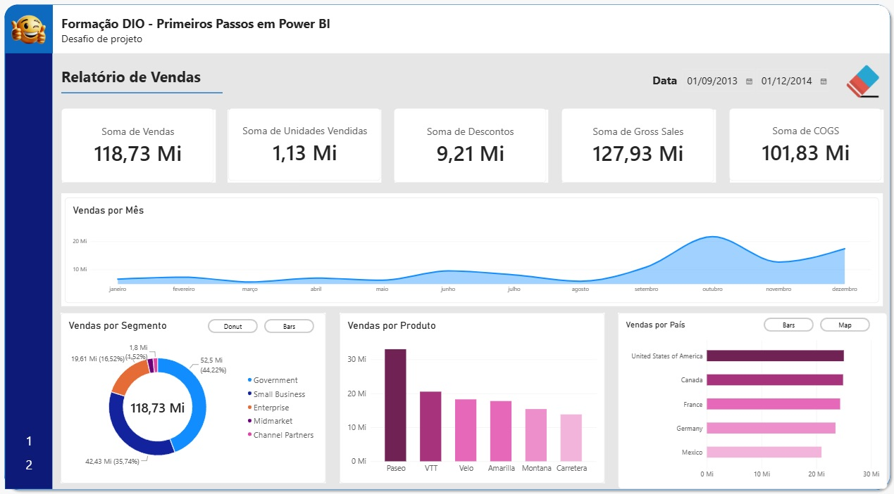
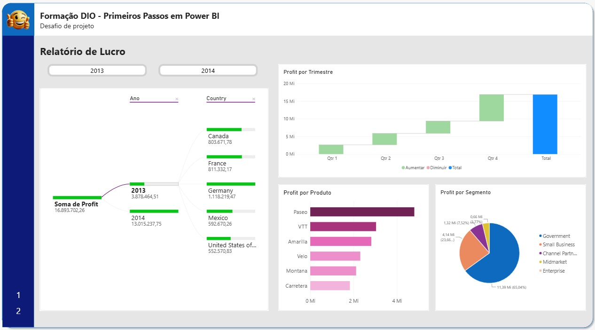

# Desafio DIO - Primeiros Passos PowerBI

## Visão Geral do Trabalho

Neste projeto foram feitos relatórios dividos em duas páginas, a primeira contendo a análise de vendas e a segunda a análise de lucro.

## Etapas do Projeto

### 1. Fontes

Foi utilizado dataset disponível no PowerBI Sample

### 2. Imagens

## Conclusões

*** Projeto para criação de relatórios com mais informações, dando continuidade ao aprendizado dos gráficos e combinações de informações, como complemento para o aprendizado, o projeto inseriu a função dos botões interativos, possibilitando alterar os tipos de gráficos e a mudança de página.

