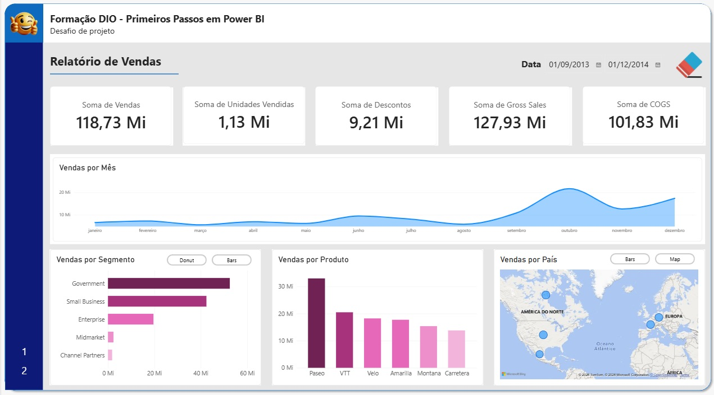
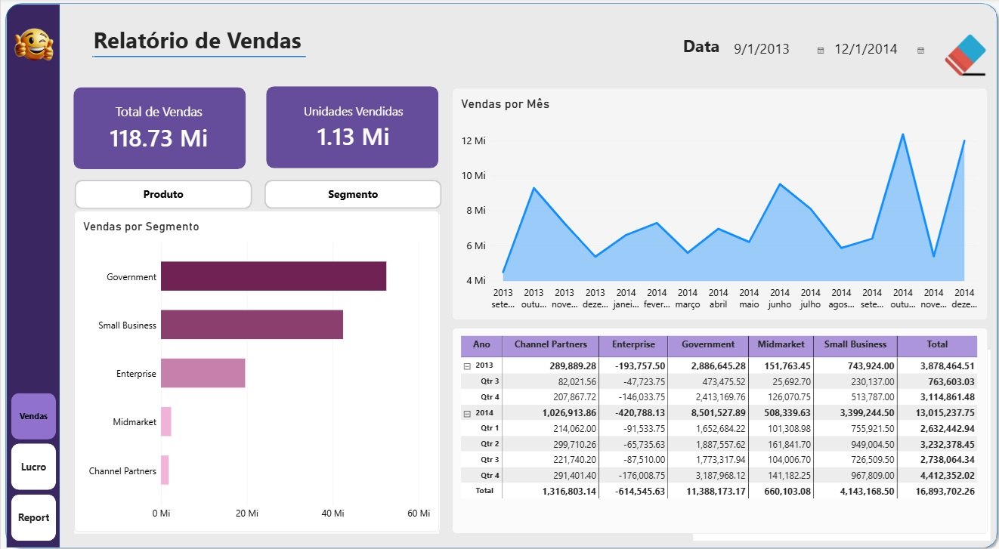
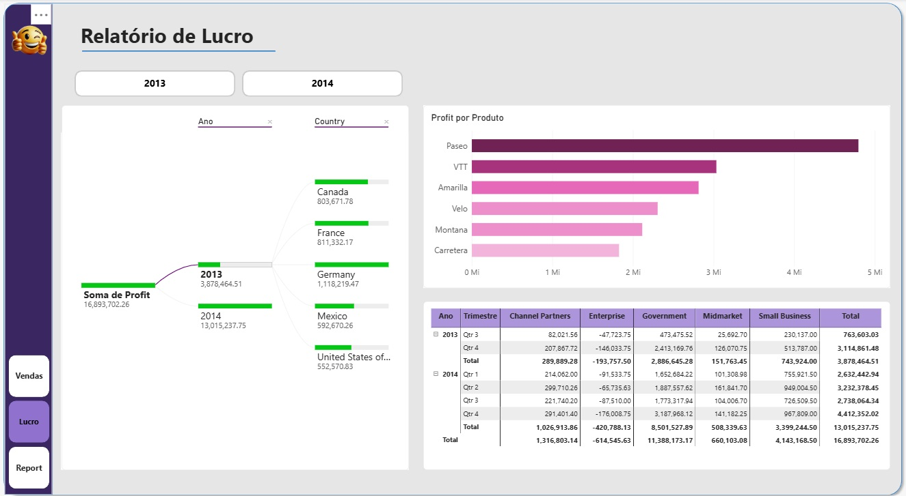
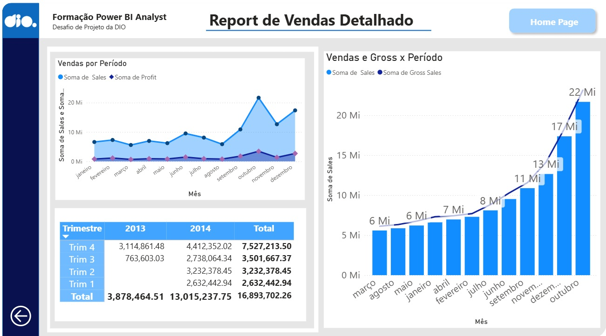
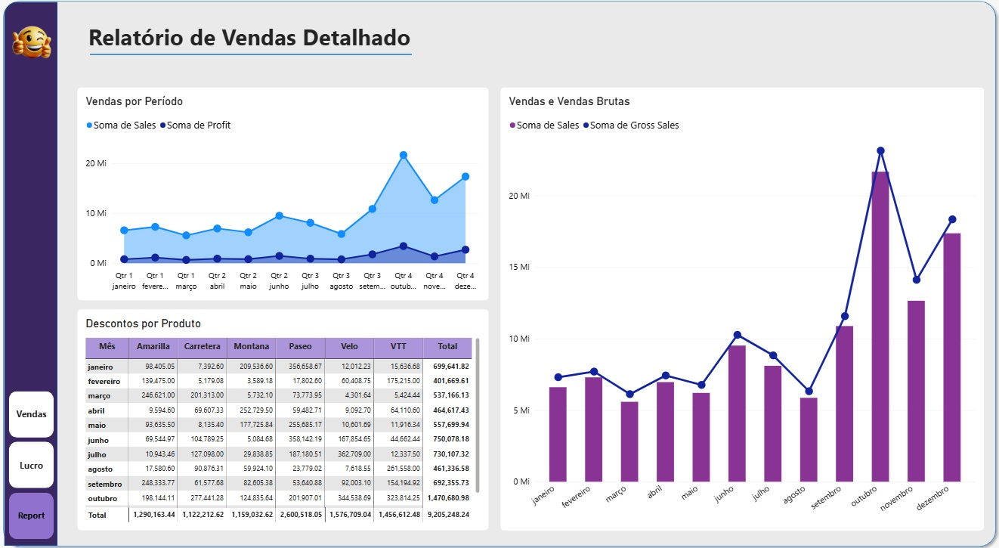

# Desafio DIO - Primeiros Passos PowerBI

## Visão Geral do Trabalho

A proposta deste projeto é utilizar um projeto anterior e modificá-lo para melhorar o posicionamento, contraste, proporção áurea e segmentação dos dados

## Etapas do Projeto

### 1. Fontes

Foi utilizado o projeto criado no desafio "Criando_Relatório"

### 2. Imagens

<figcaption>Imagem de referência, página 1, view 1</figcaption>

<figcaption>Imagem de referência, página 1, view 2</figcaption>

<figcaption>Página 1</figcaption>

---
<figcaption>Imagem de referência, página 2</figcaption>

<figcaption>Página 2</figcaption>

---
<figcaption>Imagem de referência, página 3</figcaption>

<figcaption>Página 3</figcaption>

## Conclusões

* Na página 1, foram removidos cards em excesso, simplificando e mantendo informações sobre vendas, alguns gráficos foram substituídos por uma tabela, que pode trazer com mais detalhes e precisão os números reais de vendas por segmento
* Na página 2 a tabela matriz traz o lucro por segmento, o gráfico traz o lucro por produto e a árvore traz o lucro por país
* Na página 3 estão representados algumas informações mais detalhadas de vendas e descontos
* O layout foi reformulado para conter informações mais precisas e dispostas de forma mais intuitiva
* Os botões foram reformulados indicando exatamente para onde será redirecionado 

