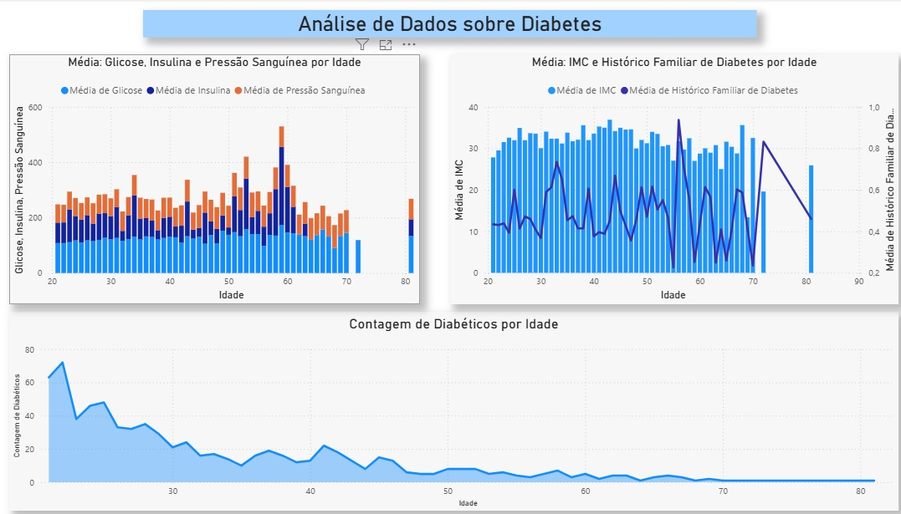
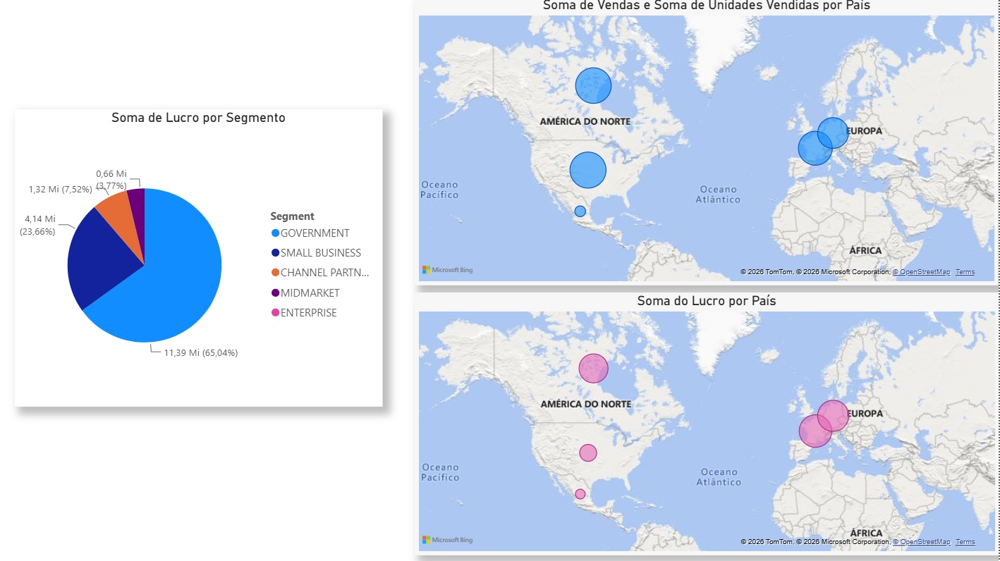

# Desafio DIO - Primeiros Passos PowerBI

## Visão Geral do Trabalho

Neste projeto foram feitas réplicas de análises visando realizar os primeiros contatos com a ferramenta e explorar algumas funções, com a criação de gráficos, alteração de fontes e formatos e combinação de informações.  

## Etapas do Projeto

### 1. Fontes

Foram utilizados datasets disponíveis no Kaggle e PowerBI Sample

### 2. Imagens

## Conclusões

***Primeiro contato para familiarizar com a ferramenta, descobrir funcionalidades e possibilidades de uso das informações.

