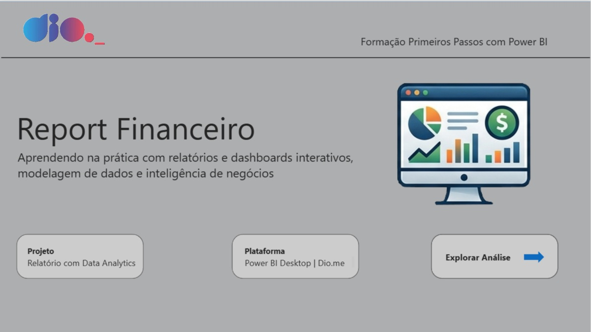
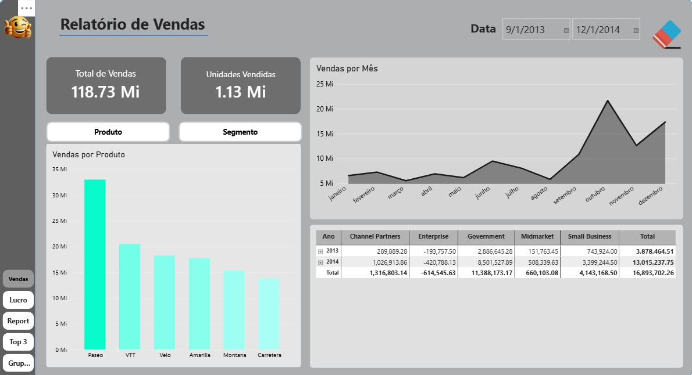
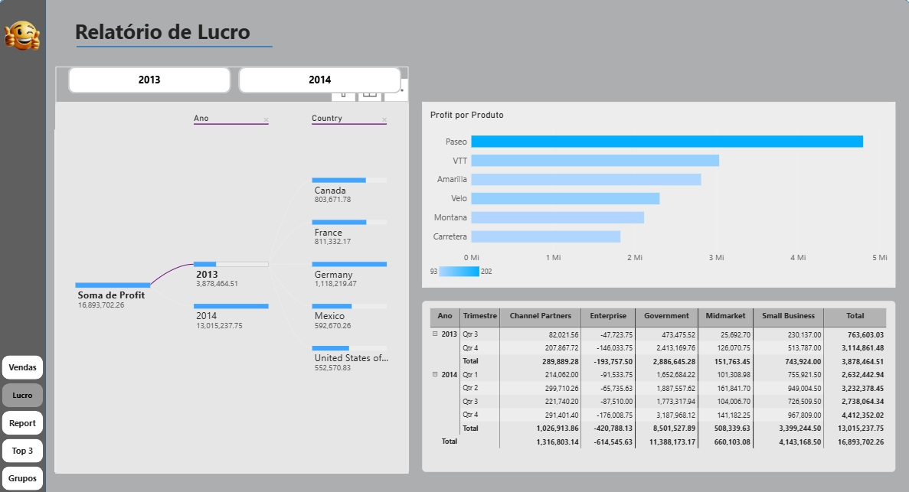
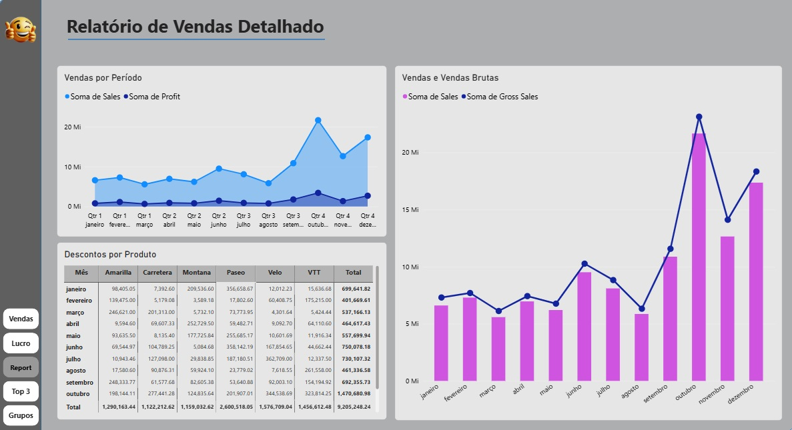
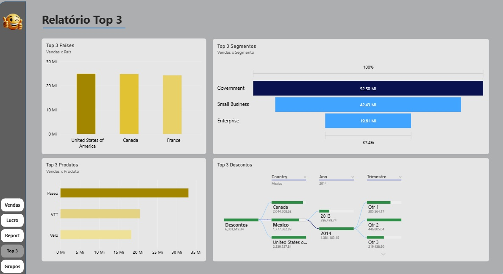
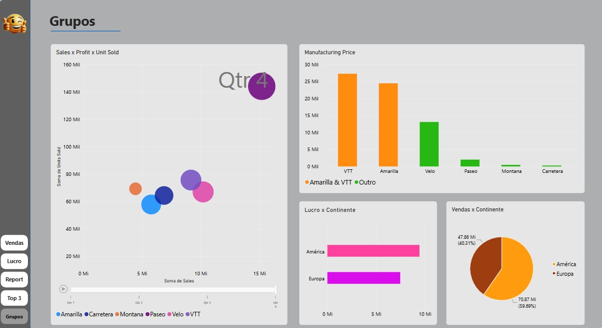

# Desafio DIO - Primeiros Passos PowerBI

## Visão Geral do Trabalho

É o último projeto do Bootcamp, neste desafio foram utilizadas diversas funcionalidades e conceitos do Power BI que praticamos durante o curso.

## Etapas do Projeto

### 1. Fontes

Foi utilizado o projeto criado no desafio "Dashboard Gerencial"

### 2. Imagens

<figcaption>Capa</figcaption>

<figcaption>Página 1</figcaption>

<figcaption>Página 2</figcaption>

<figcaption>Página 3</figcaption>

<figcaption>Página 4</figcaption>

<figcaption>Página 5</figcaption>

## Conclusões

* Além das páginas 1, 2 e 3 que já existiam no projeto anterior utilizado como base, foram adicionados mais 2 páginas de conteúdos e uma capa
* A página 4 são modelos de gráficos utilizando filtros N Superior ou Top N, mostrando um top 3 de maiores vendas, segmentos, produtos e descontos
* A página 5 são modelos de dispersão, identificando anomalias, e gráficos com conceito de agrupamento e compartimentalização.  

