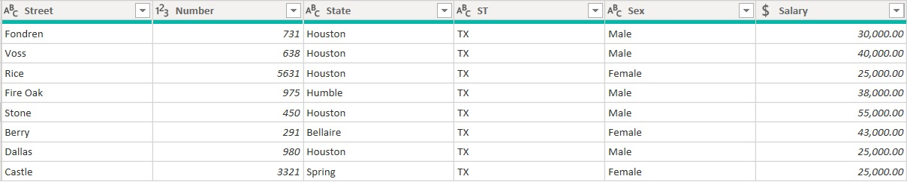
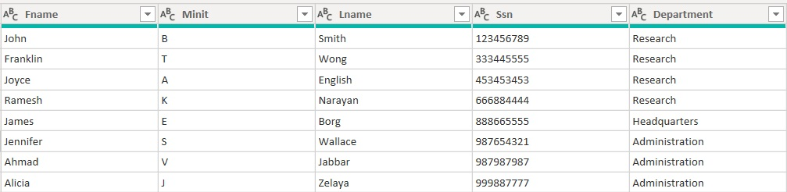
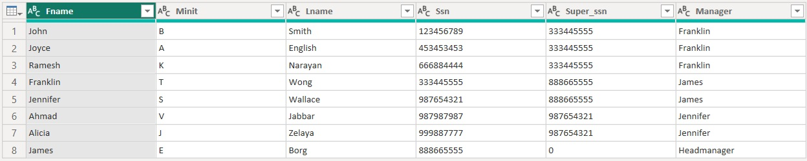
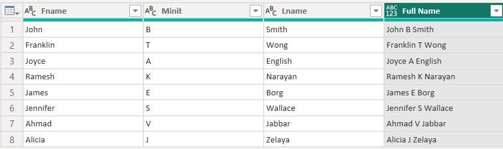
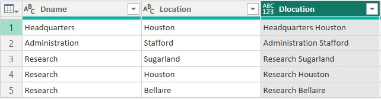
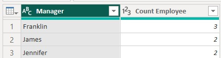
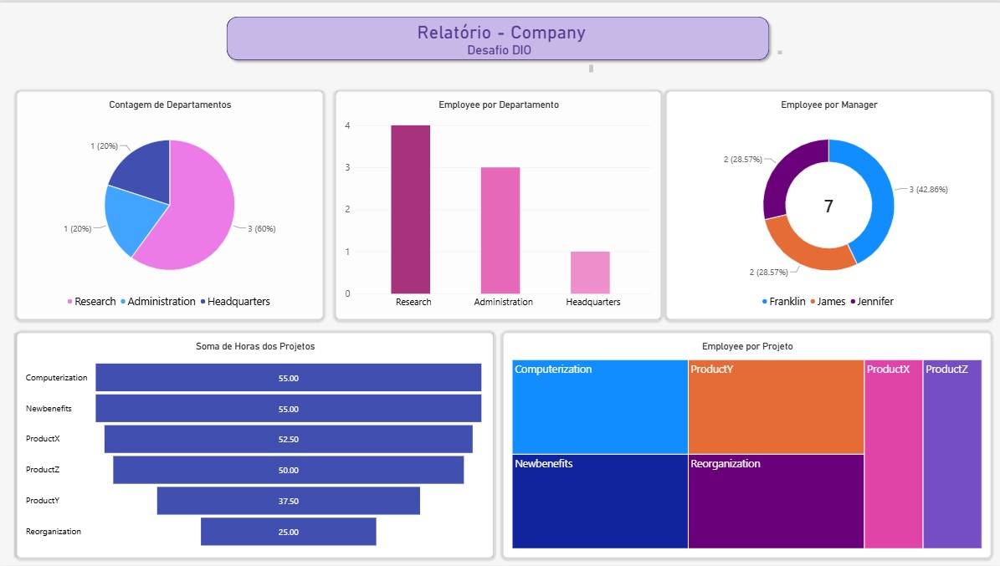

# Desafio DIO - Primeiros Passos PowerBI

## Visão Geral do Trabalho

O objetivo deste projeto foi conectar o PowerBI ao MySql, e manipular as informações do schema   

## Etapas do Projeto

### 1. Fontes

Schema MySql

### 2. Imagens
<figure>
  
  <figcaption>Alterações: Cabeçalho, tipo de informação, divisão das informações do endereço</figcaption>
</figure>
<figure>
  
  <figcaption>Alterações: Mescla da tabela employee com a tabela department, trazendo as informações do departamento de cada funcionário</figcaption>
</figure><figure>
  
  <figcaption>Alterações: Mescla da tabela employee com a tabela departament, buscando as informações de quem são os gerentes e associando quem são seus subordinados</figcaption>
</figure><figure>
  
  <figcaption>Alterações: Criação de coluna contendo o nome completo de cada funcionário</figcaption>
</figure><figure>
  
  <figcaption>Alterações: Mescla da tabela department com a tabela dept_location, fazendo a junção das informações de cada departamento com seu local para criar um departamento único</figcaption>
</figure><figure>
  
  <figcaption>Alterações: Contagem de quantos funcionários cada gerente possui</figcaption>
</figure><figure>
  
  <figcaption>A ferramenta Mesclar faz a junção de informações variadas de tabelas diferentes e inclui de forma horizontal, criando novas colunas, a ferramenta Acrescentar busca informações do mesmo tipo em tabelas diferentes e inclui de forma vertical, populando novas linhas dentro de uma coluna específica, no caso dos departamentos e localizações, precisamos que as informações estejam em colunas distintas para concaternar as informações e criar uma única para cada departamento</figcaption>
</figure><figure>
  
  <figcaption>Breve relatório do que foi feito neste desafio</figcaption>
</figure>

## Conclusões

O foco deste projeto não foi trabalhar a parte visual, a ênfase está na manipulação das informações, transformar, mesclar e corrigir erros

