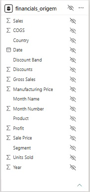
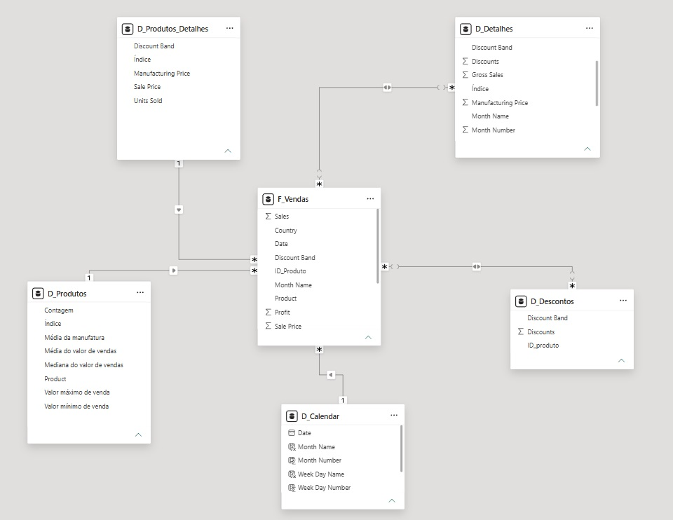

# Desafio DIO - Primeiros Passos PowerBI

## Visão Geral do Trabalho

Projeto transformando uma tabela relacional em uma dimensional do tipo star schema e utilizando método DAX para criar a tabela Calendar

## Etapas do Projeto

### 1. Fontes

<figcaption>Tabela de referência que será transformada</figcaption>

### 2. Imagens

<figcaption>Star Schema do projeto</figcaption>

## Conclusões

* A tabela referência foi destrinchada e seus componentes separados em tabelas Dimensão 
* Cada tabela Dimensão trata de uma informação específica da tabela Fato Vendas
* A tabela Calendar foi criada com DAX:
  * A coluna Date, foi criada com CALENDARAUTO() e traz uma tabela de datas fiscais baseadas nas datas mínimas e máximas do projeto
  * Month Name, FORMAT(DATE(1,D_Calendar[Month Number],1), "MMM") traz o nome escrito por extenso dos meses do ano
  * Month Number, MONTH('D_Calendar'[Date]) traz o numeral do mês
  * Week Day Name, FORMAT('D_Calendar'[Date], "DDDD") traz o nome escrito por extenso dos dias da semana
  * Week Day Number, WEEKDAY('D_Calendar'[Date]) traz o numeral do dia da semana
  * Week Number, WEEKNUM('D_Calendar'[Date]) traz o numeral da semana em relação ao ano
  * Year, YEAR('D_Calendar'[Date]) traz o ano
