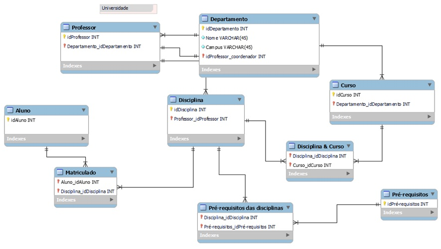
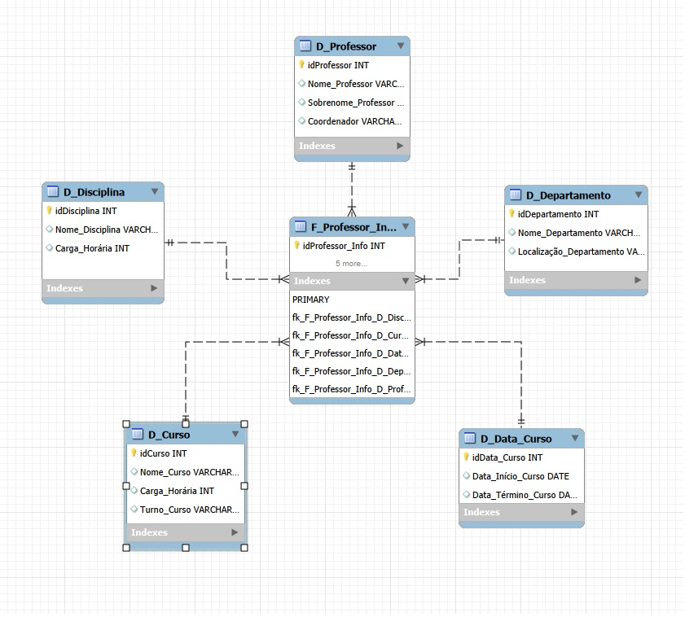

# Desafio DIO - Primeiros Passos PowerBI

## Visão Geral do Trabalho

Projeto com objetivo de transformar um diagrama relacional em um diagrama dimensional, star schema  

## Etapas do Projeto

### 1. Fontes

<figcaption>Imagem de Referência, proposta no desafio</figcaption>

### 2. Imagens

<figcaption>A tabela Fato contém o contexto analisado e busca as informações nas tabelas Dimensão que possuem os detalhes relacionados</figcaption>

## Conclusões

* Não há informações explícitas dentro das tabelas, neste projeto foram utilizados apenas os IDs 
* O objetivo foi entender o processo de modelagem e como o esquema estrela pode simplificar uma consulta e otimizar o processo
* A tabela Fato busca toda informação relacionada a cada professor, trazendo das tabelas Dimensão, o nome, disciplina, curso, localização, início e término do curso, departamento, seu coordenador
